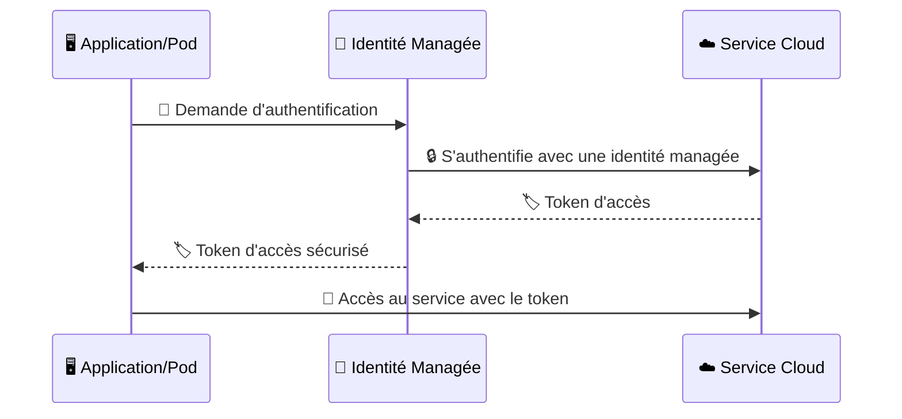
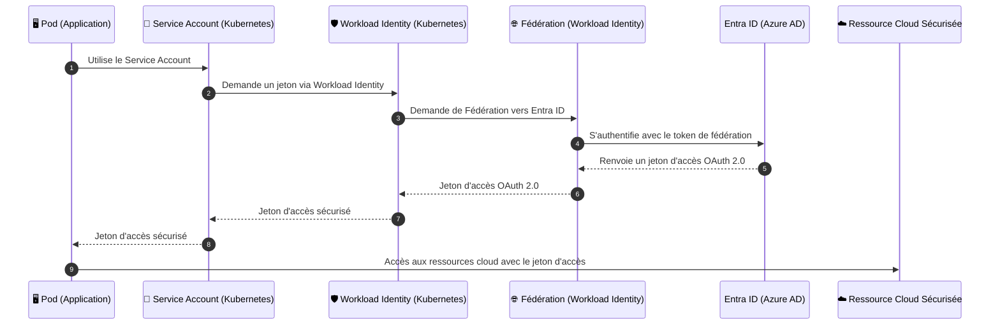
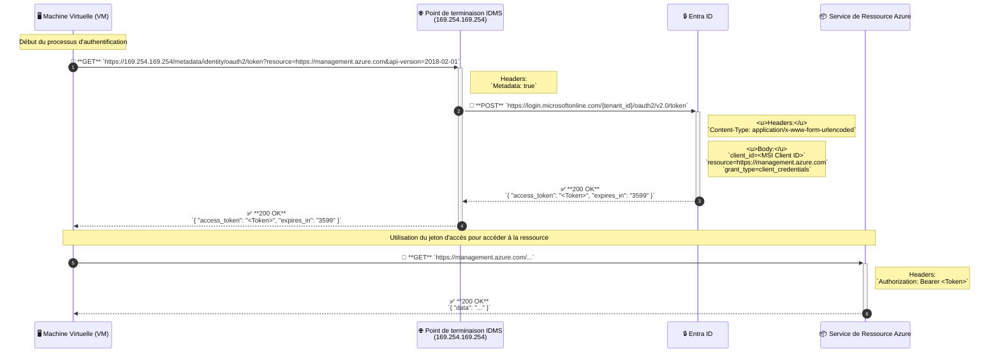
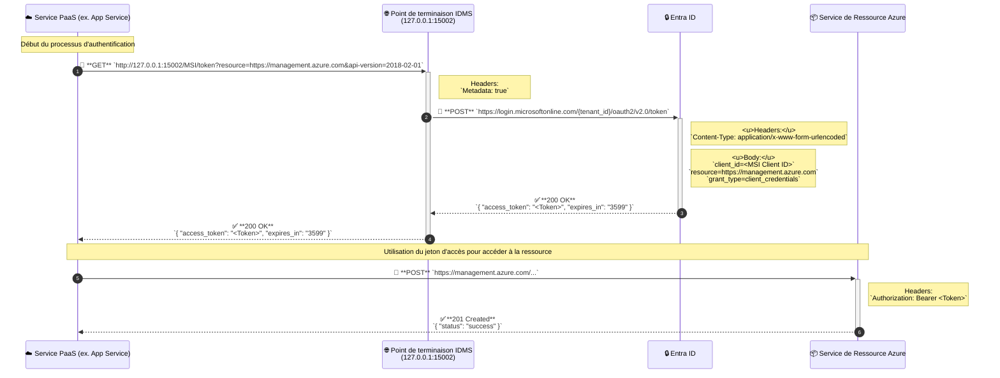
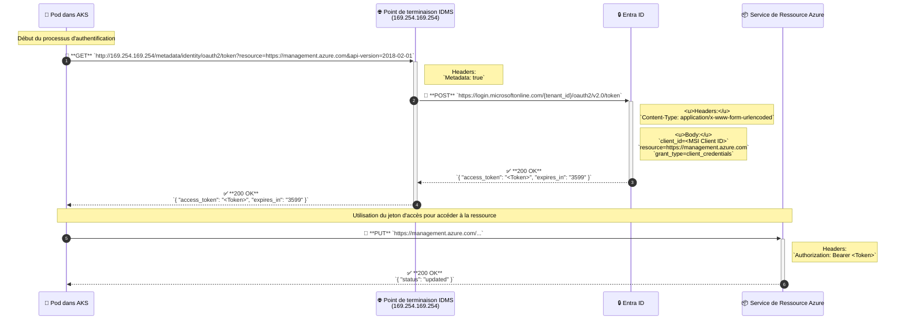

## Récapitulatif des posts Linkedin

J'ai fait une petite série de post sur Linkedin pour expliquer les identités managées. Les posts sont ici :

1. [Qu'est-ce que Managed Identity](https://www.linkedin.com/posts/etiennedeneuve_identit%C3%A9s-manag%C3%A9es-activity-7235228280625250305-k6yz)
2. [Comment fonctionnent les Managed Identity?](https://www.linkedin.com/posts/etiennedeneuve_identit%C3%A9-manag%C3%A9es-activity-7236669629455044611-S3Kh)
3. [Comment un ops se sert des Managed Identity?](https://www.linkedin.com/posts/etiennedeneuve_identit%C3%A9s-manag%C3%A9es-3-activity-7237856098282590209-fjET)
4. [Comment un dev se sert des Managed Identity?](https://www.linkedin.com/posts/etiennedeneuve_identites-managees-4-activity-7239183802969858049-M2D9)
5. [Comment se servir des Managed Identity avec Kubernetes?](https://www.linkedin.com/posts/etiennedeneuve_kubernetes-edition-activity-7240264263636783105-vhja)

Je vais reprendre les élements ici pour avoir un `Single Source of Trust` de tous ces posts ;)

## Qu'est-ce que Managed Identity

Imaginez que vos applications puissent s'authentifier auprès des services Azure sans avoir à gérer de secrets ou de clés. Pas de gestion manuelle des rotations de secrets, pas de stockage de clés sensibles dans le code... juste une authentification sécurisée et automatisée ! 💥



Avec Managed Identity, chaque ressource Azure (comme une VM, une App Service, ou même des conteneurs) peut disposer de sa propre identité gérée.

Cela signifie que vous pouvez :

- 🔒 Accéder aux ressources de manière sécurisée : Plus besoin de stocker des secrets !
- 🔄 Gérer automatiquement les identités : Rotation et gestion des identités simplifiées.
- 📊 Centraliser la gestion des accès : Directement via Microsoft Entra ID.

🛠️ Et dans Kubernetes, ça donne quoi ?

Pour ceux d'entre vous qui travaillent avec Kubernetes, la Managed Identity d'Azure devient encore plus puissante grâce au concept de Workload Identity. 🚢



Avec Workload Identity, vos pods Kubernetes peuvent utiliser Managed Identity pour s'authentifier directement auprès des services Azure sans avoir besoin de manipuler des secrets. Le tout est orchestré via une fédération avec Entra ID. 🌐

🌟 En résumé, Managed Identity et Workload Identity vous offrent :

Sécurité renforcée : Fini les secrets exposés, bienvenue à l'authentification basée sur l'identité.
Simplicité de gestion : Plus besoin de scripts ou de rotations manuelles de clés.
Centralisation des identités : Une gestion simplifiée et sécurisée des accès à l’échelle du cloud.

## Comment fonctionnent les Managed Identity?

🖥️ Comment ça fonctionne ?

L'authentification avec les identités managées varie légèrement selon le type de service :

1. Machine Virtuelle (VM) et Services PaaS : Lorsqu'une application s'exécute sur une VM ou un service PaaS (comme App Service), elle peut envoyer une requête HTTP au point de terminaison d'Identity Management Service (IDMS). Cette requête inclut le type de ressource à laquelle elle souhaite accéder. IDMS envoie ensuite une requête à Entra ID pour obtenir un jeton d'accès OAuth 2.0, qui est renvoyé à l'application pour authentification auprès des services Azure.

2. Azure Kubernetes Service (AKS) avec Workload Identity : L'évolution la plus récente des identités managées se voit dans les Azure AD Workload Identities pour AKS. Contrairement aux approches classiques où les identités managées nécessitent des composants spécifiques d'Azure, Workload Identity utilise une fédération OpenID Connect (OIDC) entre Kubernetes et Entra ID pour établir la confiance sans nécessiter d'éléments spécifiques au cloud.

### Séquence IaaS



### Séquence Service PaaS



### Séquence Kubernetes

🐳 Zoom sur Azure AD Workload Identity dans AKS

Avec Azure AD Workload Identity, vos pods AKS peuvent utiliser un ServiceAccount Kubernetes pour obtenir un Jeton JWT signé par le serveur API Kubernetes. Ce jeton est ensuite échangé contre un jeton d'accès auprès d'Entra ID. Ce flux OIDC améliore la sécurité en éliminant le besoin de gérer des secrets dans vos applications.

Les étapes clés de ce processus sont :

- 📄 Le pod demande un Jeton JWT auprès de l'API Kubernetes avec un audience spécifique à Azure AD.
- 🔑 Le JWT signé est utilisé pour interroger le fournisseur OIDC du cluster AKS.
- 🌐 Avec les métadonnées OIDC, le pod fait une demande à Entra ID pour obtenir un jeton d'accès qui sera utilisé pour accéder aux services Azure.



## Comment un ops se sert des Managed Identity?

👉 Managed Identity System Assigned vs. User Assigned :  
Alors que les identités managées "System-Assigned” sont liées directement à la ressource et sont créées/supprimées avec elle, les "User-Assigned" sont plus flexibles et peuvent être réutilisées entre plusieurs ressources.

🌟 Quelques cas pratiques ?

- Rotation automatique de secrets dans Key Vault
- Orchestration sécurisée de flux de données entre services
- Surveillance avec accès direct aux outils de sécurité d'Azure.

### Comment créer et gérer des Identités Managées

```bash
# create environment variables for later usage
export AZURE_RG_NAME="MyResourceGroup"
export AZURE_IDENTITY_NAME="MyIdentity"
export AZURE_VM_NAME="MyVm"

# login to Azure
az login

# create Azure Identity
az identity create \
    --name "${AZURE_IDENTITY_NAME}" \
    --resource-group "${AZURE_RG_NAME}"

# Assign the identity to a VM
az vm identity assign \
    -g "#{AZURE_RG_NAME}" \
    -n "${AZURE_VM_NAME}" \
    --identities "${AZURE_IDENTITY_NAME}"


```
