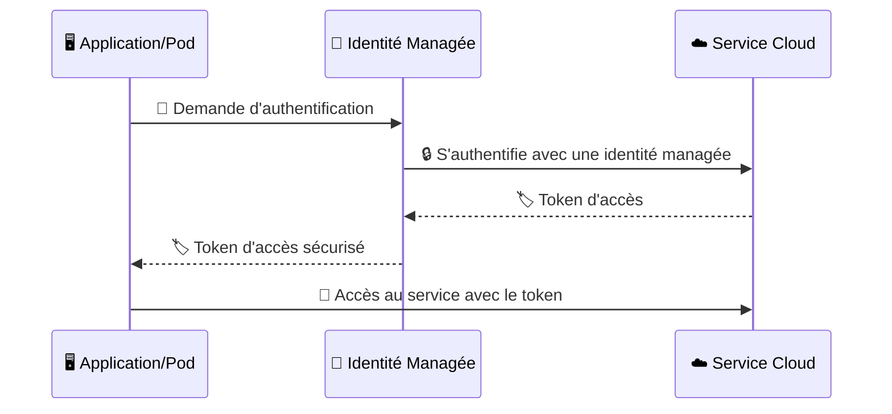
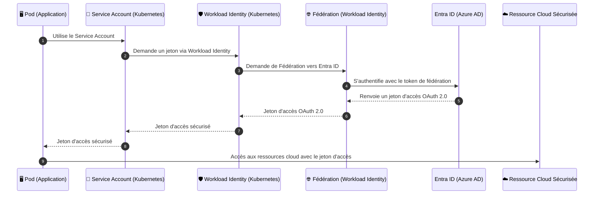
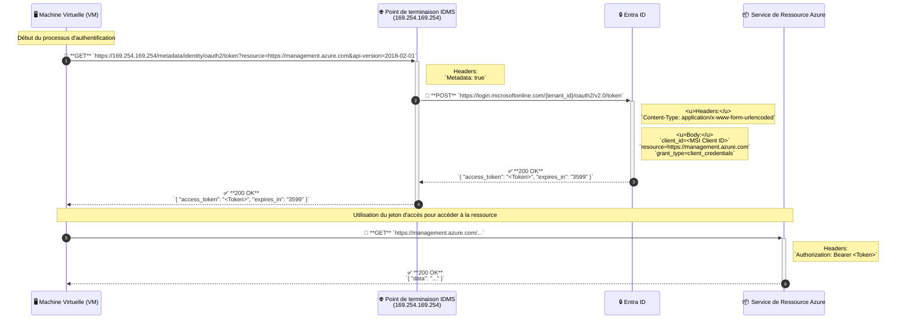
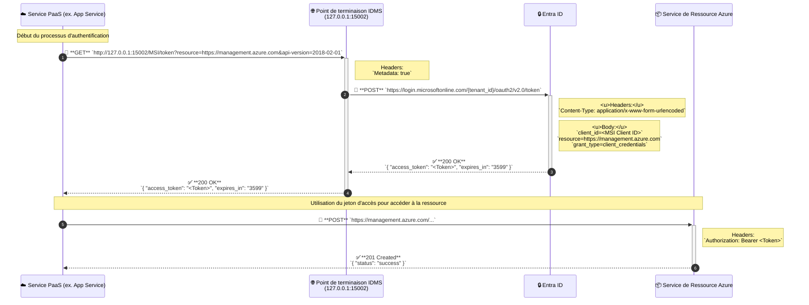
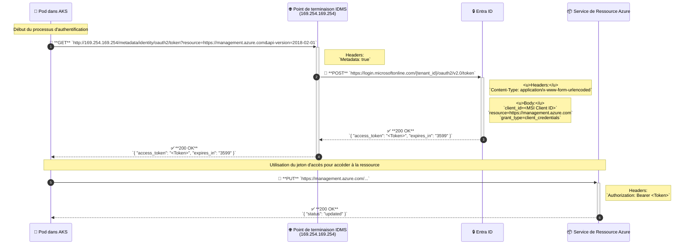

## Récapitulatif des posts Linkedin

J'ai fait une petite série de post sur Linkedin pour expliquer les identités managées. Les posts sont ici :

1. [Qu'est-ce que Managed Identity](https://www.linkedin.com/posts/etiennedeneuve_identit%C3%A9s-manag%C3%A9es-activity-7235228280625250305-k6yz)
2. [Comment fonctionnent les Managed Identity?](https://www.linkedin.com/posts/etiennedeneuve_identit%C3%A9-manag%C3%A9es-activity-7236669629455044611-S3Kh)
3. [Comment un ops se sert des Managed Identity?](https://www.linkedin.com/posts/etiennedeneuve_identit%C3%A9s-manag%C3%A9es-3-activity-7237856098282590209-fjET)
4. [Comment un dev se sert des Managed Identity?](https://www.linkedin.com/posts/etiennedeneuve_identites-managees-4-activity-7239183802969858049-M2D9)
5. [Comment se servir des Managed Identity avec Kubernetes?](https://www.linkedin.com/posts/etiennedeneuve_kubernetes-edition-activity-7240264263636783105-vhja)

Je vais reprendre les élements ici pour avoir un `Single Source of Trust` de tous ces posts ;)

## Qu'est-ce que Managed Identity

Imaginez que vos applications puissent s'authentifier auprès des services Azure sans avoir à gérer de secrets ou de clés. Pas de gestion manuelle des rotations de secrets, pas de stockage de clés sensibles dans le code... juste une authentification sécurisée et automatisée ! 💥



Avec Managed Identity, chaque ressource Azure (comme une VM, une App Service, ou même des conteneurs) peut disposer de sa propre identité gérée.

Cela signifie que vous pouvez :

- 🔒 Accéder aux ressources de manière sécurisée : Plus besoin de stocker des secrets !
- 🔄 Gérer automatiquement les identités : Rotation et gestion des identités simplifiées.
- 📊 Centraliser la gestion des accès : Directement via Microsoft Entra ID.

🛠️ Et dans Kubernetes, ça donne quoi ?

Pour ceux d'entre vous qui travaillent avec Kubernetes, la Managed Identity d'Azure devient encore plus puissante grâce au concept de Workload Identity. 🚢



Avec Workload Identity, vos pods Kubernetes peuvent utiliser Managed Identity pour s'authentifier directement auprès des services Azure sans avoir besoin de manipuler des secrets. Le tout est orchestré via une fédération avec Entra ID. 🌐

🌟 En résumé, Managed Identity et Workload Identity vous offrent :

Sécurité renforcée : Fini les secrets exposés, bienvenue à l'authentification basée sur l'identité.
Simplicité de gestion : Plus besoin de scripts ou de rotations manuelles de clés.
Centralisation des identités : Une gestion simplifiée et sécurisée des accès à l’échelle du cloud.

## Comment fonctionnent les Managed Identity?

🖥️ Comment ça fonctionne ?

L'authentification avec les identités managées varie légèrement selon le type de service :

1. Machine Virtuelle (VM) et Services PaaS : Lorsqu'une application s'exécute sur une VM ou un service PaaS (comme App Service), elle peut envoyer une requête HTTP au point de terminaison d'Identity Management Service (IDMS). Cette requête inclut le type de ressource à laquelle elle souhaite accéder. IDMS envoie ensuite une requête à Entra ID pour obtenir un jeton d'accès OAuth 2.0, qui est renvoyé à l'application pour authentification auprès des services Azure.

2. Azure Kubernetes Service (AKS) avec Workload Identity : L'évolution la plus récente des identités managées se voit dans les Azure AD Workload Identities pour AKS. Contrairement aux approches classiques où les identités managées nécessitent des composants spécifiques d'Azure, Workload Identity utilise une fédération OpenID Connect (OIDC) entre Kubernetes et Entra ID pour établir la confiance sans nécessiter d'éléments spécifiques au cloud.

### Séquence IaaS



### Séquence Service PaaS



### Séquence Kubernetes

🐳 Zoom sur Azure AD Workload Identity dans AKS

Avec Azure AD Workload Identity, vos pods AKS peuvent utiliser un ServiceAccount Kubernetes pour obtenir un Jeton JWT signé par le serveur API Kubernetes. Ce jeton est ensuite échangé contre un jeton d'accès auprès d'Entra ID. Ce flux OIDC améliore la sécurité en éliminant le besoin de gérer des secrets dans vos applications.

Les étapes clés de ce processus sont :

- 📄 Le pod demande un Jeton JWT auprès de l'API Kubernetes avec un audience spécifique à Azure AD.
- 🔑 Le JWT signé est utilisé pour interroger le fournisseur OIDC du cluster AKS.
- 🌐 Avec les métadonnées OIDC, le pod fait une demande à Entra ID pour obtenir un jeton d'accès qui sera utilisé pour accéder aux services Azure.



## Comment un ops se sert des Managed Identity?

👉 Managed Identity System Assigned vs. User Assigned :  
Alors que les identités managées "System-Assigned” sont liées directement à la ressource et sont créées/supprimées avec elle, les "User-Assigned" sont plus flexibles et peuvent être réutilisées entre plusieurs ressources.

🌟 Quelques cas pratiques ?

- Rotation automatique de secrets dans Key Vault
- Orchestration sécurisée de flux de données entre services
- Surveillance avec accès direct aux outils de sécurité d'Azure.

### Comment créer et gérer des Identités Managées

#### Creation d'une identité et assignation sur une resource

```bash
# create environment variables for later usage
export AZURE_RG_NAME="MyResourceGroup"
export AZURE_IDENTITY_NAME="MyIdentity"
export AZURE_VM_NAME="MyVm"

# login to Azure
az login

# create Azure Identity
az identity create \
    --name "${AZURE_IDENTITY_NAME}" \
    --resource-group "${AZURE_RG_NAME}"

# Assign the identity to a VM
az vm identity assign \
    -g "${AZURE_RG_NAME}" \
    -n "${AZURE_VM_NAME}" \
    --identities "${AZURE_IDENTITY_NAME}"
```

#### Assignation de privilèges

```bash
# create environment variables for later usage
export AZURE_RG_NAME="MyResourceGroup"
export AZURE_IDENTITY_NAME="MyIdentity"
export AZURE_VM_NAME="MyVm"
# login to Azure if needed ;)
az login
# get the Subscription ID
AZURE_SUB_ID=$(az account show --query 'id' -o tsv)
# Affect a role to a managed identity
az role assignment create \
    --assignee "{assignee}" \
    --role "Reader" \
    --scope "/subscriptions/${AZURE_SUB_ID}/resourceGroups/${AZURE_RG_NAME}"
```

#### Utilisation d'une identité managée sur une vm

```bash
# You will need to get the value of either client id or object id or the resource id
# so from your machine :
# To get the resource id:
az identity show --resource-group "${AZURE_RG_NAME}" \
    --name "${AZURE_IDENTITY_NAME}"\
    --query id -o tsv
# Or to get the client id
az identity show --resource-group "${AZURE_RG_NAME}" \
    --name "#{AZURE_IDENTITY_NAME}" \
    --query clientId -o tsv
# Or to get the object id
az identity show --resource-group "${AZURE_RG_NAME}" \
    --name "${AZURE_IDENTITY_NAME}" \
    --query principalId -o tsv
# connect to your VM
# Linux is assumed, start a shell
# Windows is working too with Azure CLI
az login --identity --username ‹one of the 3 options>
```

## Comment un dev se sert des Managed Identity?

Pour les développeurs, les identités managées simplifient l'authentification et l'autorisation des applications avec d'autres services Azure.

Nous savons tous que les développeurs n'aiment pas gérer des secrets.

Ci-dessous, vous trouverez des exemples de code avec le SDK Azure Identity qui permet de s'en passer !

Vous verrez que la fonction ou méthode est quasiment identique partout.

Il faut tout de même préciser un point **important**, le SDK Azure Identity permets également de récupéré des tokens
valide avec d'autre sources, dans cette ordre :

- Environment
- Workload Identity
- Managed Identity
- Visual Studio
- Visual Studio Code
- Azure CLI
- Azure PowerShell
- Azure Developer CLI
- Interactive browser

Pour plus de détails, la documentation Microsoft est plutôt complète => [](https://learn.microsoft.com/en-us/dotnet/api/overview/azure/identity-readme?view=azure-dotnet#defaultazurecredential)

### C#

```csharp
using System;
using Azure.Identity;
using Azure.Security.KeyVault.Secrets;

class Program
{
    static void Main(string[] args)
    {
        string keyVaultUrl = "https://<your-key-vault-name>.vault.azure.net/";

        // Create a client using DefaultAzureCredential, which supports Managed Identity
        var client = new SecretClient(new Uri(keyVaultUrl), new DefaultAzureCredential());

        // Retrieve a secret from Key Vault
        var secret = client.GetSecret("<your-secret-name>");

        Console.WriteLine($"Secret Value: {secret.Value.Value}");
    }
}
```

### Go

```go
package main

import (
	"context"
	"fmt"
	"github.com/Azure/azure-sdk-for-go/sdk/azidentity"
	"github.com/Azure/azure-sdk-for-go/sdk/keyvault/azsecrets"
)

func main() {
	// Define the Key Vault URL
	keyVaultUrl := "https://<your-key-vault-name>.vault.azure.net/"

	// Create a new DefaultAzureCredential for Managed Identity authentication
	cred, err := azidentity.NewDefaultAzureCredential(nil)
	if err != nil {
		fmt.Printf("failed to obtain credential: %v\n", err)
		return
	}

	// Create a new client for accessing secrets
	client, err := azsecrets.NewClient(keyVaultUrl, cred, nil)
	if err != nil {
		fmt.Printf("failed to create client: %v\n", err)
		return
	}

	// Retrieve a secret from Key Vault
	secretResp, err := client.GetSecret(context.Background(), "<your-secret-name>", nil)
	if err != nil {
		fmt.Printf("failed to get secret: %v\n", err)
		return
	}

	fmt.Printf("Secret Value: %s\n", *secretResp.Value)
}
```

### NodeJs

```javascript
import { DefaultAzureCredential } from "@azure/identity";
import { SecretClient } from "@azure/keyvault-secrets";

async function main() {
  const keyVaultUrl = "https://<your-key-vault-name>.vault.azure.net/";

  // Create a client using DefaultAzureCredential, which supports Managed Identity
  const credential = new DefaultAzureCredential();
  const client = new SecretClient(keyVaultUrl, credential);

  // Retrieve a secret from Key Vault
  const secret = await client.getSecret("<your-secret-name>");
  console.log(`Secret Value: ${secret.value}`);
}

main().catch((err) => console.error("Error:", err));
```

### Java

```java
import com.azure.identity.DefaultAzureCredential;
import com.azure.identity.DefaultAzureCredentialBuilder;
import com.azure.security.keyvault.secrets.SecretClient;
import com.azure.security.keyvault.secrets.SecretClientBuilder;
import com.azure.security.keyvault.secrets.models.KeyVaultSecret;

public class Main {
    public static void main(String[] args) {
        // Replace with your Key Vault URL
        String keyVaultUrl = "https://<your-key-vault-name>.vault.azure.net/";

        // Create a DefaultAzureCredential instance, which supports Managed Identity
        DefaultAzureCredential defaultCredential = new DefaultAzureCredentialBuilder().build();

        // Create a SecretClient using the DefaultAzureCredential
        SecretClient secretClient = new SecretClientBuilder()
            .vaultUrl(keyVaultUrl)
            .credential(defaultCredential)
            .buildClient();

        // Retrieve a secret from Key Vault
        KeyVaultSecret secret = secretClient.getSecret("<your-secret-name>");

        // Print the secret value
        System.out.println("Secret Value: " + secret.getValue());
    }
}
```

## Comment se servir des Managed Identity avec Kubernetes?

### Pré-Requis

Pour utiliser les Identités Managées sur un cluster AKS vous devez activer l'`oidc-issuer` et `workload-identity` :

```bash
export RESOURCE_GROUP= "MyRg"
export CLUSTER_NAME= "myAks"
# update the cluster
az aks update \
    --resource-group "${ RESOURCE_GROUP}"
    --name "${CLUSTER_NAME}" \
    --enable-oidc-issuer \
    --enable-workload-identity
```

La procédure dure quelques minutes, soyez patient ;)

```bash
# get the oidc issuer
export AKS_OIDC_ISSUER="$(az aks show --name "${CLUSTER_NAME}" \
    --resource-group "${RESOURCE_GROUP}" \
    --query "oidcIssuerProfile. issuerUrl" \
    --output tsv)"
```

### Création de l'Identité Managée

```bash
export RESOURCE_GROUP="MyRg"
export CLUSTER_NAME="myAks"
export SUBSCRIPTION="$(az account show --query id --output tsv)"
export LOCATION="westeurope"
export USER_ASSIGNED_IDENTITY_NAME="myAksIdentity"
# create the managed identity
az identity create \
    --name "${USER_ASSIGNED_IDENTITY_NAME}" \
    -- resource-group "${RESOURCE_GROUP}" \
    --location "${LOCATION}" \
    --subscription "${SUBSCRIPTION}"
# Store it in a variable
export USER_ASSIGNED_CLIENT_ID="$(az identity show \
    --resource-group "${RESOURCE_GROUP}" \
    --name "${USER_ASSIGNED_IDENTITY_NAME}" \
    --query 'clientId' \
    --output tsv)"
```

### Création du Service Account dans le cluster

```bash
export RESOURCE_GROUP="MyRg"
export CLUSTER_NAME="myAks"
export SUBSCRIPTION="$(az account show --query id --output tsv)"
export LOCATION="westeurope"
export USER_ASSIGNED_IDENTITY_NAME="myAksIdentity"
export SERVICE_ACCOUNT_NAME= 'myService'
export SERVICE_ACCOUNT_NAMESPACE='default'
# connect to the aks cluster
az aks get-credentials --name "${CLUSTER_NAME}" --resource-group "${RESOURCE_GROUP}"
# create the service account in the cluster :
cat <<EOF | kubectl apply -f -
apiVersion: v1
kind: ServiceAccount
metadata:
  annotations:
    azure.workload. identity/client-id: "${USER_ASSIGNED_CLIENT_ID}"
  name: "${SERVICE_ACCOUNT_NAME}"
  namespace: "${SERVICE_ACCOUNT_NAMESPACE}"
EOF
```

### Création de la fédération

```bash
export RESOURCE_GROUP="MyRg"
export CLUSTER_NAME="myAks"
export SUBSCRIPTION="$(az account show --query id --output tsv)"
export LOCATION="westeurope"
export USER_ASSIGNED_IDENTITY_NAME="myAksIdentity"
export FEDERATED_ IDENTITY _CREDENTIAL_NAME="myFedAksIdentity"
export SERVICE_ACCOUNT_NAME= 'myService'
export SERVICE_ACCOUNT_NAMESPACE= 'default'

# connect to the aks cluster
az identity federated-credential create \
    --name "${FEDERATED_IDENTITY_CREDENTIAL_NAME}" \
    --identity-name "${USER_ASSIGNED_IDENTITY_NAME}" \
    --resource-group "${RESOURCE_GROUP}" \
    --issuer "${AKS_OIDC_ISSUER}" \
    --subject system:serviceaccount:"${SERVICE_ACCOUNT_NAMESPACE}":"${SERVICE_ACCOUNT_NAME}" \
    --audience api://AzureADTokenExchange
```

### Utilisation sur un pod

```bash
# In the Deployment or in you pod now you can use this id
# You need to add a new label
kubectl patch pod <podname> \
    -n ${SERVICE_ACCOUNT_NAMESPACE} \
    -p '{"labels" :{"azure.workload.identity/use":"true"}}'
# and you need to update the spec.serviceAccountName
kubectl edit pods <podname> \
    -n ${SERVICE_ACCOUNT_NAMESPACE}
# change the service account name by the new one !
```
